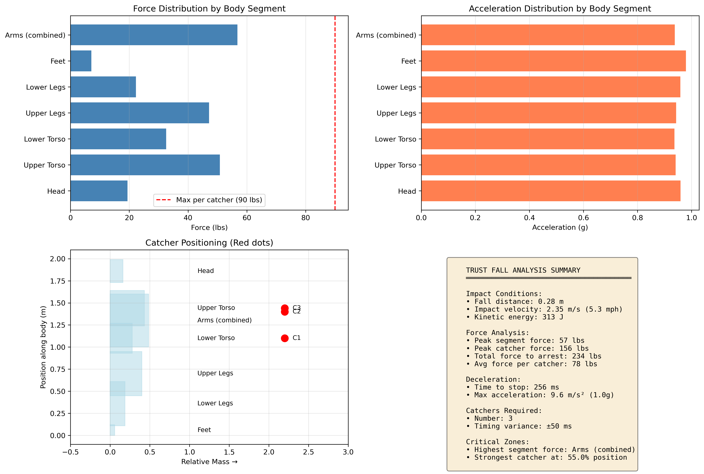

# Trust Fall Force Distribution Analysis

A physics simulation tool that models rigid body dynamics with rotational effects for analyzing asymmetric catching scenarios in trust fall exercises. The tool calculates force distributions across body segments and determines optimal catcher configurations to ensure safety.

## Features

- **Physics-based simulation** with rotational dynamics
- **Body segmentation analysis** using anthropometric data
- **Force distribution calculations** for each body segment
- **Catcher optimization** to minimize individual catcher loads
- **Visualization tools** with comprehensive charts and diagrams
- **CLI and GUI interfaces** for different use cases
- **Validation tests** to ensure physics conservation laws

## Example Output



*Example visualization showing force distribution analysis for a 250 lb person falling from 1.5m platform with 4-foot catch height*

## Installation

### Prerequisites
- Python 3.8 or higher
- pip package manager

### Step 1: Clone or Download
```bash
# If using git
git clone <repository-url>
cd "Trust Fall Force Distribution Analysis"

# Or download and extract the ZIP file
```

### Step 2: Install Dependencies
```bash
pip install -r requirements.txt
```

The required packages are:
- `numpy>=1.24.0` - Numerical computations
- `matplotlib>=3.7.0` - Plotting and visualization
- `PyQt5>=5.15.0` - GUI framework

### Step 3: Verify Installation
```bash
python trust_fall_analysis.py --help
```

## Usage

### Command Line Interface (CLI)

Run the analysis with default parameters:
```bash
python trust_fall_analysis.py
```

This will:
- Analyze a 250 lb, 2.0m tall person
- Simulate a 1.5m platform fall to 1.219m catch height
- Find optimal catcher configurations for different arm compression scenarios
- Generate validation tests for physics conservation
- Save visualization to `~/Downloads/trust_fall_analysis.png`

#### Default Parameters
- **Person Mass**: 250 lbs (113.4 kg)
- **Person Height**: 2.0 meters
- **Platform Height**: 1.5 meters  
- **Catch Height**: 1.219 meters (4 feet)
- **Deceleration Distance**: 0.3 meters (arm compression)
- **Timing Variance**: 0.05 seconds

#### Output Information
The CLI provides:
- Impact velocity and kinetic energy calculations
- Minimum catcher requirements for different scenarios
- Segment-by-segment force analysis
- Optimal catcher positioning recommendations
- Force distribution to individual catchers
- Comprehensive validation tests

### Graphical User Interface (GUI)

Launch the interactive GUI:
```bash
python trust_fall_gui.py
```

#### GUI Features
- **Input Parameters**: Modify person mass, height, platform height, catch height, deceleration distance, and timing variance
- **Real-time Calculations**: Fall distance is computed automatically as you change platform and catch heights
- **Interactive Visualization**: Four-panel analysis showing force distributions, accelerations, body diagram, and summary statistics
- **Save Functionality**: Export visualizations to PNG files
- **Input Validation**: Prevents invalid configurations and provides helpful error messages

#### GUI Usage Steps
1. **Launch**: Run `python trust_fall_gui.py`
2. **Configure**: Adjust parameters in the "Simulation Parameters" section
3. **Run**: Click "Run Simulation" to generate analysis
4. **Review**: Examine the four-panel visualization
5. **Save**: Use "Save Visualization" to export results

## Understanding the Results

### Force Analysis
- **Peak Segment Force**: Maximum force experienced by any body segment
- **Peak Catcher Force**: Maximum force any individual catcher must handle
- **Force per Catcher**: Average force distributed across all catchers
- **Total Force**: Combined force needed to arrest the fall

### Safety Guidelines
- **Maximum Safe Force**: 400N (~90 lbs) per catcher is recommended
- **Deceleration Time**: Shorter times require higher forces
- **Body Segment Analysis**: Heavier segments (torso, legs) experience higher forces

### Catcher Positioning
The tool optimizes catcher positions based on:
- Mass distribution along the body
- Timing variance effects
- Geometric force distribution

## Physics Validation

The simulation includes comprehensive validation tests:
1. **Force Conservation**: Catcher forces equal COM deceleration force
2. **Rotational Effects**: Segments have different accelerations due to rotation
3. **F = ma Verification**: Total force equals mass times deceleration
4. **Mass Conservation**: Sum of segment masses equals total body mass
5. **Energy Conservation**: Work done equals kinetic energy dissipated

## Customization

### Modifying Body Segments
Edit the `BODY_SEGMENTS` array in `trust_fall_analysis.py` to adjust:
- Mass fractions of body segments
- Position along body length
- Segment lengths

### Adjusting Physics Parameters
Modify simulation parameters:
- `timing_variance`: How much catch timing varies between catchers
- `deceleration_distance`: How far arms compress during catch
- `max_force_per_catcher`: Safety threshold for individual catchers

## Troubleshooting

### Common Issues

**Import Errors**:
```bash
# Ensure all dependencies are installed
pip install --upgrade -r requirements.txt
```

**GUI Won't Launch**:
```bash
# Check PyQt5 installation
python -c "from PyQt5.QtWidgets import QApplication; print('PyQt5 OK')"
```

**Permission Errors**:
```bash
# On macOS/Linux, ensure script is executable
chmod +x trust_fall_analysis.py trust_fall_gui.py
```

**Visualization Not Saving**:
- Check write permissions in the target directory
- Ensure sufficient disk space
- Try saving to a different location

## Technical Details

### Physics Model
- **Rigid Body Dynamics**: Treats body as collection of connected segments
- **Rotational Effects**: Accounts for asymmetric catching creating rotation
- **Moment of Inertia**: Calculated from segment mass distribution
- **Force Distribution**: Based on geometry and timing factors

### Anthropometric Data
Based on Winter (2009) and Clauser et al. (1969) studies for adult male body segment parameters.

### Mathematical Foundation
See the comprehensive mathematical documentation at the end of `trust_fall_analysis.py` for detailed equations covering:
- Free fall kinematics
- Deceleration dynamics
- Rotational motion
- Force distribution algorithms
- Energy conservation principles

## License

This project is provided as-is for educational and safety analysis purposes. Always consult with qualified professionals before conducting actual trust fall exercises.